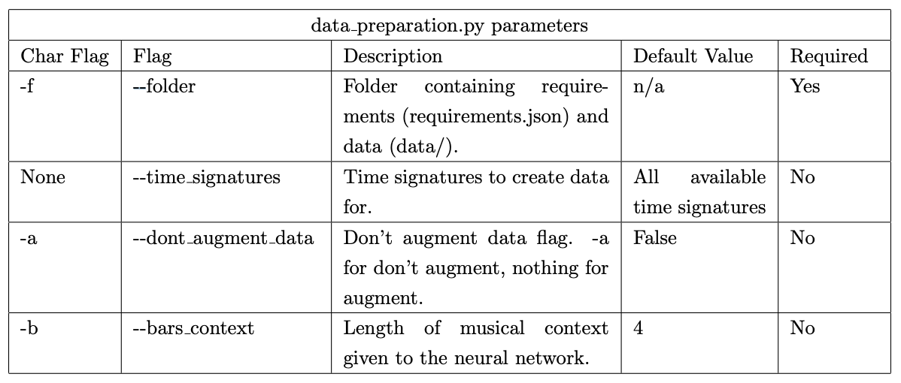
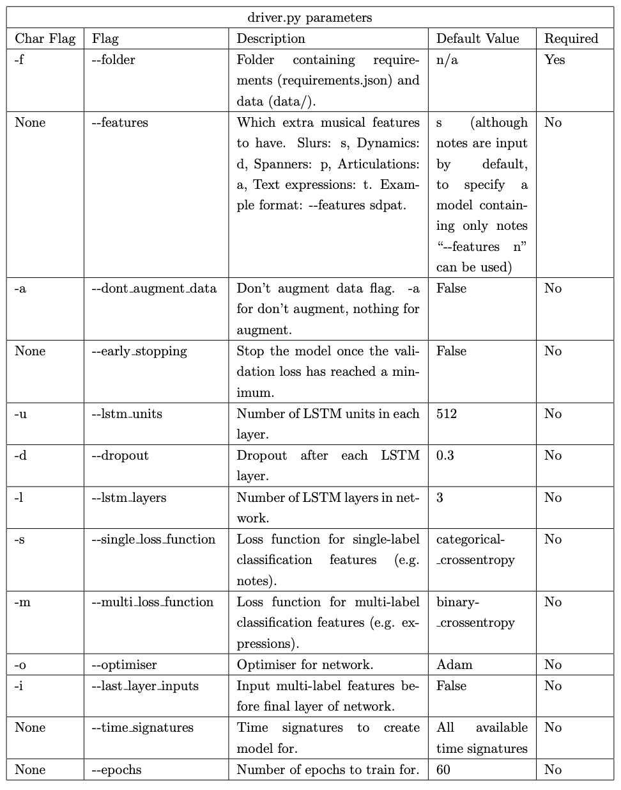
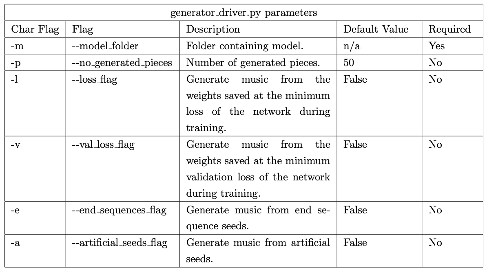

# Sightly 
A tool for generating graded sight-reading music

## Introduction
This project was completed as an experiment into the possibility of generating sheet music suitable for practising ones sight-reading ability in preparation for a music exam. It was developed as a third year dissertation project as part of my Computer Science degree at the University of Warwick. In addition to the code, I have provided the written dissertation which is a detailed report of this experiment and sheds light on some of the design choices of the finished system.

## Project Summary
- Created a system for taking in existing sight-reading music and preparing it for learning
- Developed a neural network structure for learning patterns within the music
- The result is a model capable of producing music
- The actual effectiveness of models produced is further analysed in the provided report

## Preamble
The Keras library is only supported up to Python 3.6, so Python 3.6 must be used to run the system.
The requirements.txt contains the libraries required to run the system, these must be installed.

A few notes:
- to train a model with notes only, do --features n. The "n" has no influence since notes are used by default, however the lack of any other feature implies you want notes only, it could be replaced by any string not containing any of the key feature characters.
- .ipynb files are used for analysis, they are not needed for any generation
- losses.py is a script containing the focal loss implementation taken from: https://github.com/umbertogriffo/focal-loss-keras written by   @umbertogriffo, this is NOT my original work
- example_models/ is a folder containing some trained models and generated music
- abrsm_grade_5_violin/ is a folder showing the exemplar structure of a system folder and contains the required items needed for generation (data/ and requirements.json)
  

Different files are used to separate the functionality of the system.
In addition to these files, there are files containing the \"driver code\" used to run each stage on some
given data. All driver code scripts contain command line parameters
which can be used to change how the code is run - most parameters are
optional and have default values. Argument parsing is handled by the
argparse package; all optional and required
arguments for a file, along with their descriptions, can be found by
running the following code in the command line:
`python <filename>.py –help`.

## Inputs Required

The inputs required in order to generate sight-reading music are: a
dataset of test pieces and a JSON file containing the requirements of
the instrument and grade. The format of each key-value pair are explained
below:

- These represent the allowed note lengths, each defined as a
  fraction of a quarter note (quaver).

- The possible time signatures that could appear in the grade.

- The possible key signatures that could appear in the grade.
  Positive numbers indicate the number of sharps; negative numbers
  indicate the number of flats.

- The allowed lengths of rests, each defined as a fraction of a
  quarter note (quaver).

- The range of piece lengths that could feature in the grade,
  measured in number of bars.

- The range of pitches allowed in the grade.

- The possible keys that could appear in the grade. Capitalised
  letters represent major keys, lowercase letters represent minor
  keys, and the \"-\" character represents \"flat\".

```{.json language="json" startFrom="1"}
{
      "quarter_lengths": [1, 0.5, 2, 3, 1.5, 0.75, 0.25],
      "time_signatures": ["4/4", "2/4", "3/4", "6/8"],
      "key_signatures": [1, 2, 3, 0, -1, -2, -3, 4, -4],
      "rest_lengths": [1, 2, 0.5],
      "length": [8, 16],
      "pitch_range": ["G3", "E6"],
      "keys": [
        "D", "A", "G", "e", "C", "F", "B-", "a", "d", "g", "E-", "E", "A-", "b", "c"
      ]
}
```

## Preparing Data

All data preprocessing can be run using the
`data_preparation.py` script.
This script takes in a folder containing the data and requirements for a
specific instrument grade, as well as a number of optional arguments,
and performs all data processing required. This includes, but is not
limited to: all preprocessing, analysing the data for seed rhythms, and
splitting the data into train, test and validation data.

---



---

## Training a Model

A model can be trained by running the `driver.py` script. The only
required parameter is, again, the folder containing the data (and now
preprocessed data too) and the JSON file containing the grade
requirements. Optional parameters can be used to modify the default
layout of the model or to change other aspects of training.

---



---

## Generating Music

Music can be generated from a trained model by running the
`generator_driver.py` script
with the location of the model folder as a parameter. If
neither the loss_flag or val_loss_flag are chosen, both are set to
true. If neither the end_sequences_flag or artificial_seeds_flag are
chosen, both are set to true.

---



---
